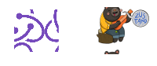

<p align="center">
  

  <h1 align="center">React With Redux and Zustand</h1>

  <!-- <p align="center">
    🔗 <a href="https://URLThisProject.com">https://URLThisProject.com</a> 🔗
  </p> -->

Developed the video player project to learn React with Redux and Zustand.

Four branches were created for the purpose of study:

- To study Redux, access the following branches:

  - ["redux-todo"](https://github.com/VagnerNerves/react-with-redux-and-zustand-ignite/tree/redux-todo): In this branch, the implementation of Redux with a to-do list is found, showcasing the basic concepts. The Redux Provider was created in App.tsx, and the store configuration was set up in index.ts. A "slice" was also created within the reducers, containing functions like "add". Additionally, "useSelector" was used to retrieve items from the to-do list, while "useDispatch" was employed to perform updates.

  - ["redux-player-without-api"](https://github.com/VagnerNerves/react-with-redux-and-zustand-ignite/tree/redux-player-whithout-api): In this branch, the implementation of Redux without the use of an API is demonstrated, focusing on a video player project. The "slice" was separated, and functions within the reducers were created, along with tests using "vitest".

  - ["redux-player-with-api"](https://github.com/VagnerNerves/react-with-redux-and-zustand-ignite/tree/redux-player-with-api): In this branch, the implementation of Redux with an API is showcased in the video player project. Interfaces were created, and the use of Async Thunk to perform asynchronous queries in Redux was learned.

- To study Zustand, access the branch:

  - ["main"](https://github.com/VagnerNerves/react-with-redux-and-zustand-ignite/tree/main): In this branch, Zustand and all its functionalities were integrated into the video player project.

</p>

## 🧭 Table of contents

- [🧭 Table of contents](#-table-of-contents)
- [🎥 Implementation Video](#-implementation-video)
- [💡 Technologies Used](#-technologies-used)
- [🚀 Running the Project](#-running-the-project)
  - [Front-end Web](#front-end-web)
- [🌎 License](#-license)
- [✒ Author](#-author)

## 🎥 Implementation Video

https://github.com/VagnerNerves/react-with-redux-and-zustand-ignite/assets/40831841/f36f644d-1049-488c-b1a3-e3e3611aa698

<!-- ## 🎨 Layout

Layout developed by [Name](https://www.instagram.com/urlName/)

[](https://www.figma.com/files) -->

<!-- ## 👏 Learning and more Implementations

Describe what you learned and implemented in the project. -->

## 💡 Technologies Used

- [x] [React](https://reactjs.org/)
- [x] [Vite](https://vitejs.dev/)
- [x] [Redux](https://redux.js.org/)
- [x] [Zustand](https://github.com/pmndrs/zustand)
- [x] [TypeScript](https://www.typescriptlang.org/)
- [x] [Tailwindcss](https://tailwindcss.com/)
- [x] [Lucide](https://lucide.dev/)
- [x] [Radix](https://www.radix-ui.com/)
- [x] [React Player](https://github.com/cookpete/react-player)
- [x] [Axios](https://axios-http.com/ptbr/)
- [x] [JSON Server](https://github.com/typicode/json-server)
- [x] [Vitest](https://vitest.dev/)

<!-- ## 📂 Folder Structure

```plainText
app
.
├── __tests__
├── android                     # Native android files
├── ios                         # Native ios files
├── src                         # Source files
│   ├── @types                  # Contains all global definitions of types and interfaces
│   ├── assets                  # Contains Js bundles assets. e.g: icons, splash, images etc...
│   ├── components              # Contains all global react components
│   ├── context                 # All contexts
│   ├── constants               # Constants files
│   ├── hooks                   # Cstomized hooks
│   ├── navigation
│   ├── screens
│   ├── services                # Contains external and api services
│   ├── App                     # Aplication entry
.
.
├── index                       # Bundle entry
.
.
└── README.md
``` -->

## 🚀 Running the Project

<!-- ### Back-end

Clone the project

```bash
  git clone https://link-para-o-projeto
```

Enter the project directory

```bash
  cd my-project
```

Install with dependencies

```bash
  npm install
```

Start the server

```bash
  npm run start
``` -->

### Front-end Web

Clone the project

```bash
  git clone https://github.com/VagnerNerves/react-with-redux-and-zustand-ignite.git
```

Enter the project directory

```bash
  cd react-with-redux-and-zustand-ignite
```

Install with dependencies

```bash
  npm install
```

Start the server

```bash
  # Run Server:
  npm run server

  # Run Web:
  npm run dev

  # Run test:
  npm run test
  npm run test:watch
```

<!-- ### Mobile

Clone the project

```bash
  git clone https://link-para-o-projeto
```

Enter the project directory

```bash
  cd my-project
```

Install with dependencies

```bash
  npm install
```

Start the server

```bash
  npx expo start
```

- IOS:

```bash
  npx pod-install && npx react-native run-ios
```

- Android:

```bash
  npx react-native run-android
``` -->

<!-- ## 📝 Routes

[](https://app.getpostman.com/run-collection/link)
[](https://insomnia.rest/run/?label=NAMEPROJECT&uri=LINK) -->

## 🌎 License

This project is under the MIT license. See the [LICENSE](https://github.com/VagnerNerves/react-with-redux-and-zustand-ignite/blob/main/LICENSE) file for more details.

## ✒ Author

<p align="center">
  

  <h3 align="center">Vagner Nerves</h3>

  <p align="center">
    Made with love and hate 😅, get in touch!
  </p>
</p>

<div align="center">

[](https://www.linkedin.com/in/vagnernervessantos/)
[](mailto:vagnernervessantos@gmail.com)
[](https://github.com/VagnerNerves)

</div>

<!-- #Comando para rodar
npm run dev

#Comando para teste
npm run test
npm run test:watch

#Comando para roda o server
npm run server -->
